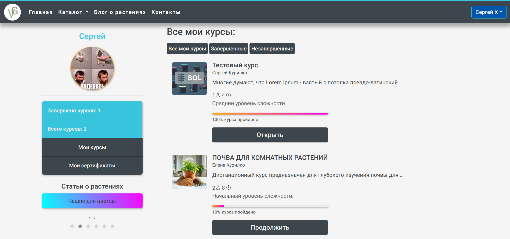
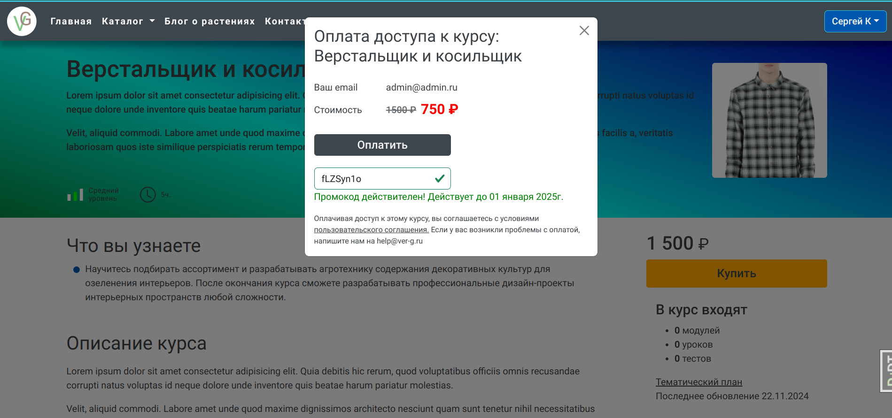
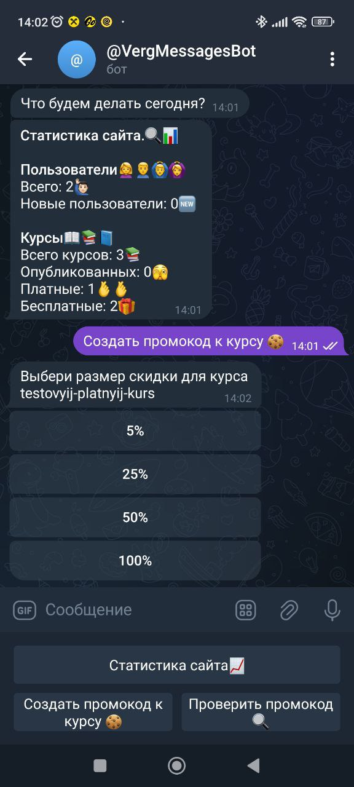

# ver-g.ru


## Описание

Проект представляет из себя веб-платформу, созданную на Django, которая включает в себя несколько приложений:
- Площадка для пошагового прохождения онлайн-курсов с регистрацией, системой подписок, оплат, скидок(промокодов), получением сертификатов, комментариям к шагам;
- Блог, с комментариями к статьям и системой выставления оценок;
- Портфолио, содержащее примеры работ по озеленению интерьера;
- Каталог услуг с формами заявок. Заявки отправляются администратору telegram ботом с использованием celery;
- API, для взаимодействия администратора с площадкой (просмотр статистики площадки обучения, создание промокодов к курсам обучения);
- Telegram бот для взаимодействия администратора с API, аутентификация осуществляется через специальный API-ключ, расположенный в переменной окружения и класс наследуемый от BaseAuthentication (DRF).

В проекте активно используется JS(jQuery) для ajax запросов к БД.

Проект запущен и работает по адресу:
https://ver-g.ru/

## Содержание

1. [Описание](#описание)
2. [Функциональность](#функциональность)
3. [Технологии](#технологии)
4. [Установка](#установка)
5. [Использование](#использование)
6. [Скриншоты](#скриншоты)
7. [Контакты](#контакты)

## Функциональность

### Площадка для обучения
- Регистрация и аутентификация пользователей.
- Просмотр и прохождение курсов.
- Система получения доступа к прохождению курсов.
- Оплата курсов через платежные шлюзы.
- Отслеживание прогресса обучения.
- Получение сертификатов о прохождении курса.

### Блог
- Публикация статей.
- Комментирование статей.
- Оценка статей.

### Портфолио
- Публикация примеров работ.
- Заказ услуги через форму.

### Каталог услуг
- Публикация услуги.
- Заказ услуг через форму.

### API
- Предоставление доступа для статистики платформы обучения.
- Создание промокода на скидку для курса обучения.
- Проверка актуальности промокода.
- Удаление комментария к статье.

### Telegram бот
- Отправка статистики платформы обучения.
- Отправка оповещений об активностях на площадке обучения.
- Создание промокода на скидку к курсу обучения.
- Проверка актуальности промокода.
- Отправка заявок на услуги, отправленных через формы на сайте.

### Дополнительные возможности
- Использование Redis для кэширования.
- Выполнение асинхронных задач с помощью Celery и Redis.
- Использование Js-скриптов для ajax-запросов.

## Технологии

- **Django**: Основной фреймворк.
- **Django Rest Framework**: для API.
- **Redis**: Используется для кэширования и выполнения задач Celery.
- **Celery**: Для асинхронных задач.
- **HTML/CSS/JavaScript**: Для фронтенда.
- **jQuery**: Для ajax запросов и фронтенда.
- **Bootstrap**: Для стилизации.
- **yookassa**: Для обработки платежей.
- **pyTelegramBotAPI**: Для telegram бота.
- **aiohttp**: Для взаимодействия telegram бота с API.
- **WeasyPrint**: Для генерирования изображения сертификата о прохождении курса.

## Установка
1. Колнируйте репозиторий:
   ```bash
   git clone https://github.com/SergeyKurilko/ver-g.git
   ```
2. Перейдите в каталог ver-g
   ```bash
   cd ver-g
   ```
3. Создайте виртуальное окружение и активируйте его:
   ```bash
   python3 -m venv venv
   source venv/bin/activate 
   ```
4. Создайте в каталоге проекта переменную .env для хранения переменных окружения. Список необходимых переменных можно посмотреть в ver-g/vertograd/settings.py
6. Выполните миграции:
   ```bash
   python manage.py migrate
   ```
7. Запустите сервер:
   ```bash
   python manage.py runserver
   ```
7. В другом терминале запустите Celery:
   ```bash
   celery -A vertograd worker --loglevel=info
   ```
8. Для запуска телеграм бота, так же запустите его в отдельном терминале:
   ```bash
   /ver-g$ python3 ver_g_bot.py
   ```

### Использование

#### Для пользователя
1. Откройте браузер и перейдите по адресу `http://ver-g.ru/`.
2. Исследуйте блог.
3. В разделе `услуги` перейдите по ссылке `обучение` или по адресу `http://ver-g.ru/academy/`
4. Исследуйте площадку обучения, посмотрите список курсов, выберите подходящий.
5. Оплатите курс и начните обучение.

#### Для администратора
1. Войдите в админ-панель по адресу `/admin`.
2. Заполните форму входа.
3. В панеле выберите необходимое приложение для создания курса обучения, модуля для курса обучения, статьи для блога, промокода, услуги или работы для порфолио.

### Скриншоты
#### Общий вид страницы со статьями:


#### Общий вид страницы списка услуг:


#### Страница услуги "Обучение", она же площадка для обучения:


#### Страница списка курсов:


#### Страница "Мои курсы" с курсами, на который подписан пользователь:


#### Страница с описанием курса:


### Форма оплаты доступа к прохождению курса:



#### Прохождение шагов курса (перемещение по шагам):


#### Пример работы бота
##### Запуск

#### Запрос отчета по площадке обучения

#### Создание промокода для курса (получение списка курсов) в данном примере он один, т.к. сайт еще не наполнен курсами.

#### Выбор размера скидки

#### Выбор срока действия промокода

#### Информация о созданном промокоде

#### Проверка актуальности промокода


